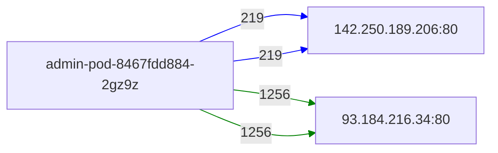

# Grafana Dependency Plugin

## What is Grafana Dependency Plugin?

Grafana Service Dependency Plugin allows users to visualize how Pods send and
receive traffic to and from other Pods and Services. To help visualize the
flows, the plugin shows them 'inside' the Node they are a part of.


A line pointing from source to destination is also shown, with the amount of
data transmitted in the selected time range labelling the line.


The plugin is also able to visualize traffic sent between IP addresses in and
out of Pods. The arrows are labelled by the content length of the HTTP response
and the color of the line represents its status.



## Acknowledgements

The Service Dependency Graph Plugin is created using [mermaid-js](https://mermaid-js.github.io/mermaid/#/)

## Data Source

Supported Databases:

- ClickHouse

## Queries Convention

Currently the Service Dependency Graph Plugin is created for restricted uses,
only for visualizing transmitted data between Pods and Services. For correct
loading of data for the Service Dependency Graph Plugin, the query is expected
to return the following fields, in arbitrary order.

- field 1: sourcePodName value with name or an alias of `sourcePodName`
- field 2: sourcePodLabels value with name or alias of `sourcePodLabels`
- field 3: sourcePodNamespace value with name or alias of `sourcePodNamespace`
- field 4: sourceNodeName value with name or an alias of `sourceNodeName`
- field 5: sourceIP value with name or an alias of `sourceIP`
- field 6: sourceTransportPort value with name or an alias of `sourceTransportPort`
- field 7: destinationPodName value with name or an alias of `destinationPodName`
- field 8: destinationPodLabels value with name or an alias of `destinationPodLabels`
- field 9: destinationNodeName value with name or an alias of `destinationNodeName`
- field 10: destinationServicePortName value with name or an alias of `destinationServicePortName`
- field 11: destinationIP value with name or an alias of `destinationIP`
- field 12: destinationTransportPort value with name or an alias of `destinationTransportPort`
- field 13: octetDeltaCount value with name or an alias of `octetDeltaCount`
- field 14: httpVals value with name or an alias of `httpVals`

ClickHouse query example:

```sql
SELECT sourcePodName,
sourcePodLabels,
sourcePodNamespace,
sourceNodeName,
sourceIP,
sourceTransportPort,
destinationPodName,
destinationPodLabels,
destinationNodeName,
destinationServicePortName,
destinationIP,
destinationTransportPort,
octetDeltaCount,
httpVals
FROM flows
WHERE sourcePodNamespace NOT IN ('kube-system', 'flow-visibility', 'flow-aggregator')
   AND destinationPodNamespace NOT IN ('kube-system', 'flow-visibility', 'flow-aggregator')
   AND octetDeltaCount != 0
   AND l7ProtocolName != ''
ORDER BY flowEndSeconds DESC
```

## Installation

### 1. Install the Panel

Installing on a local Grafana:

For local instances, plugins are installed and updated via a simple CLI command.
Use the grafana-cli tool to install chord-panel-plugin from the commandline:

```shell
grafana-cli --pluginUrl https://downloads.antrea.io/artifacts/grafana-custom-plugins/theia-grafana-dependency-plugin-1.0.0.zip plugins install theia-grafana-dependency-plugin
```

The plugin will be installed into your grafana plugins directory; the default is
`/var/lib/grafana/plugins`. More information on the [cli tool](https://grafana.com/docs/grafana/latest/administration/cli/#plugins-commands).

Alternatively, you can manually download the .zip file and unpack it into your grafana
plugins directory.

[Download](https://downloads.antrea.io/artifacts/grafana-custom-plugins/theia-grafana-dependency-plugin-1.0.0.zip)

Installing to a Grafana deployed on Kubernetes:

In Grafana deployment manifest, configure the environment variable `GF_INSTALL_PLUGINS`
as below:

```yaml
env:
- name: GF_INSTALL_PLUGINS
   value: "https://downloads.antrea.io/artifacts/grafana-custom-plugins/theia-grafana-dependency-plugin-1.0.0.zip;theia-grafana-dependency-plugin"
```

### 2. Add the Panel to a Dashboard

Installed panels are available immediately in the Dashboards section in your Grafana
main menu, and can be added like any other core panel in Grafana. To see a list of
installed panels, click the Plugins item in the main menu. Both core panels and
installed panels will appear. For more information, visit the docs on [Grafana plugin installation](https://grafana.com/docs/grafana/latest/plugins/installation/).

## Customization

### 3. Customize the Panel Options

Users can customize the panel by editing its options and choosing to group the
diagram based on a chosen Pod label. It is also possible to change the color
of the Pod squares in the diagram. Additionally, users can switch between layer
4 and layer 7 visualizations.


### 4. Further Customization

This plugin is built with [@grafana/plugin](https://grafana.com/developers/plugin-tools/),
which is a CLI that enables efficient development of Grafana plugins. To customize
the plugin and do local testings:

1. Install dependencies

   ```bash
   cd grafana-dependency-plugin
   yarn install
   ```

2. Build plugin in development mode or run in watch mode

   ```bash
   yarn dev
   ```

   or

   ```bash
   yarn watch
   ```

3. Build plugin in production mode

   ```bash
   yarn build
   ```

## Learn more

- [Build a panel plugin tutorial](https://grafana.com/tutorials/build-a-panel-plugin)
- [Grafana documentation](https://grafana.com/docs/)
- [Grafana Tutorials](https://grafana.com/tutorials/) - Grafana Tutorials are step-by-step
guides that help you make the most of Grafana
- [Grafana UI Library](https://developers.grafana.com/ui) - UI components to help you build interfaces using Grafana Design System
